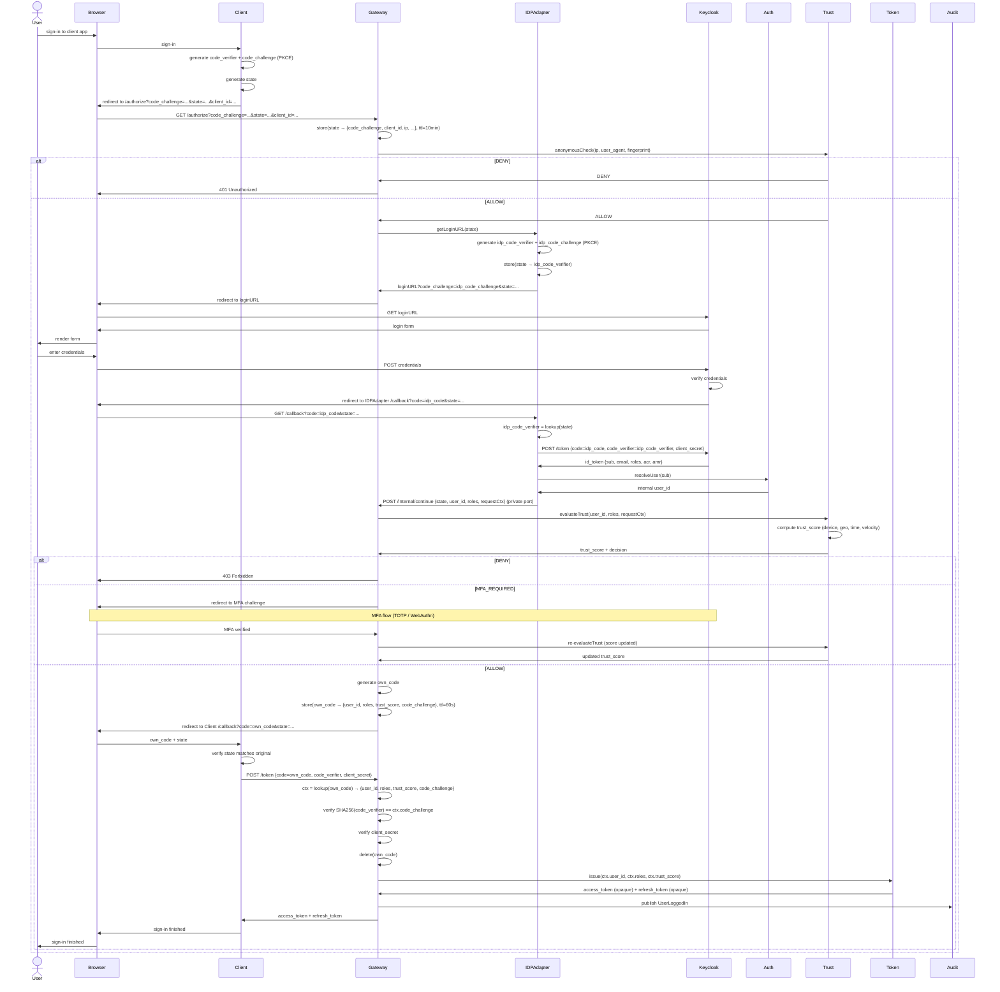
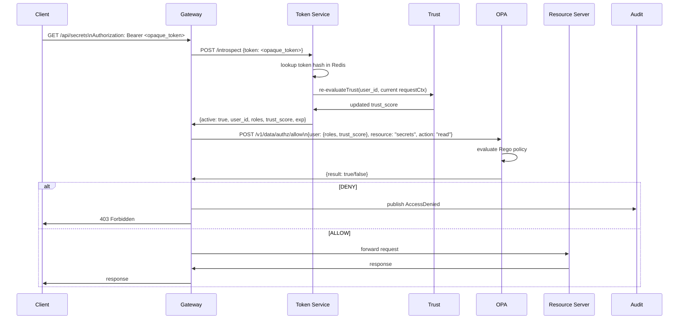
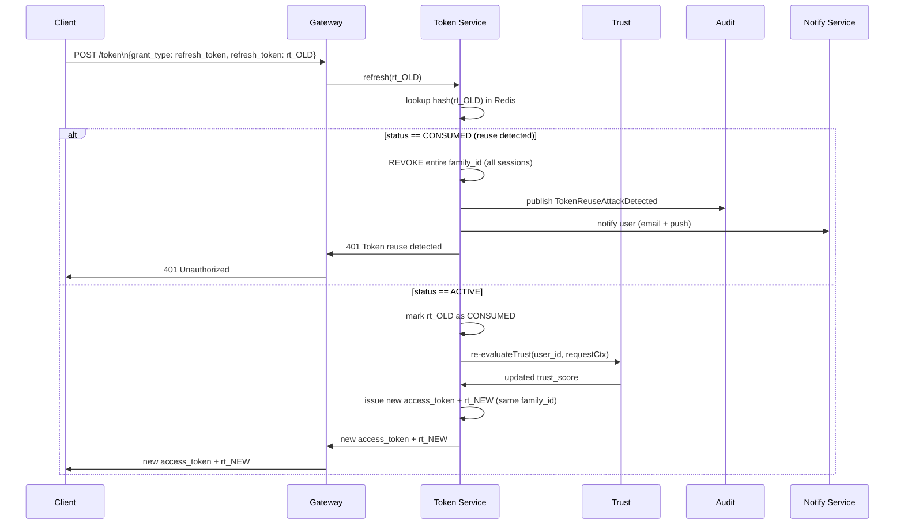
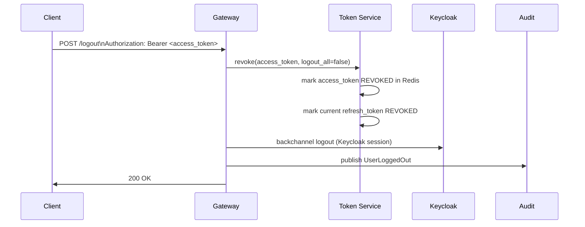

# Sequence Diagrams

## Login Flow (OAuth 2.0 Authorization Code + PKCE)



---

## API Request Flow (with Token Introspection + OPA)



---

## Token Refresh Flow (with Rotation + Reuse Detection)



---

## Logout Flow



---

## Trust Score Computation Detail

```
Signals collected per request:
┌─────────────────┬────────┬───────────────────────────────────────┐
│ Signal          │ Weight │ Source                                │
├─────────────────┼────────┼───────────────────────────────────────┤
│ device_known    │  0.25  │ Redis: trust:devices:{user_id}        │
│ ip_reputation   │  0.20  │ External API (cached Redis 1h)        │
│ geo_anomaly     │  0.30  │ Compare Redis trust:last:{user_id}    │
│ time_of_day     │  0.15  │ PG: trust_working_hours               │
│ velocity        │  0.10  │ Redis: trust:fails:{user_id}          │
└─────────────────┴────────┴───────────────────────────────────────┘

trust_score = Σ(signal.score × signal.weight)

Decisions:
  ≥ 0.80 → ALLOW
  0.50–0.79 → MFA_REQUIRED
  0.30–0.49 → STEP_UP
  < 0.30 → DENY

Impossible travel detection:
  distance_km(last_ip, current_ip) / time_hours > 900 → penalty -0.45
```
